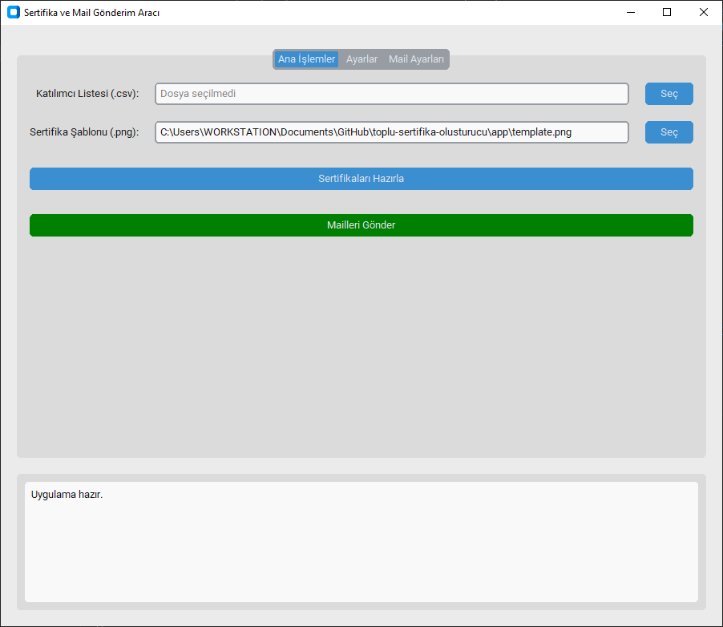
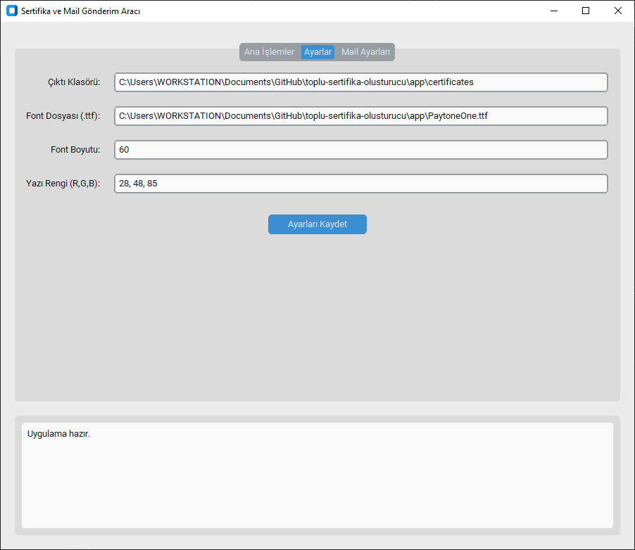
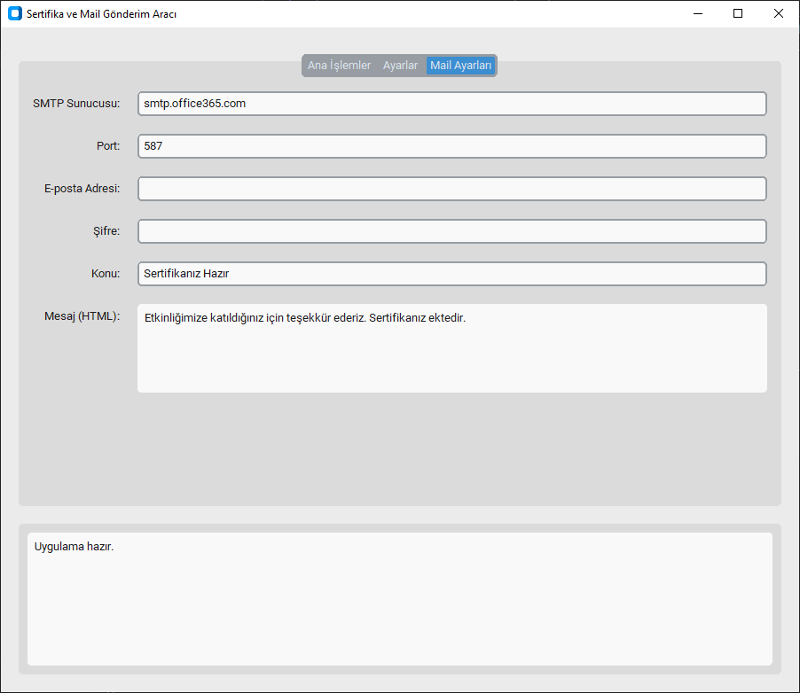

# Sertifika Hazırlama ve Gönderme Aracı

Bu proje, etkinlik katılımcıları için toplu sertifika hazırlamak ve e-posta yoluyla göndermek amacıyla geliştirilmiş, kullanıcı dostu arayüze sahip bir masaüstü uygulamasıdır.

## Özellikler

*   **Grafik Arayüz (GUI):** Modern ve kullanımı kolay arayüz.
*   **Toplu Sertifika Oluşturma:** CSV dosyasından katılımcı listesini okur ve her biri için kişiselleştirilmiş sertifika oluşturur.
*   **E-posta Gönderimi:** Oluşturulan sertifikaları katılımcıların e-posta adreslerine otomatik olarak gönderir.
*   **Özelleştirilebilir Ayarlar:** Font, yazı rengi, yazı boyutu, e-posta konusu, mesaj içeriği ve SMTP sunucu ayarları (Gmail, Outlook vb. için) arayüz üzerinden kolayca değiştirilebilir.
*   **Log Takibi:** İşlem durumlarını anlık olarak takip edebileceğiniz log ekranı.

## Kurulum

1.  Projeyi bilgisayarınıza indirin.
2.  Gerekli kütüphaneleri yükleyin:
    ```bash
    pip install -r requirements.txt
    ```

## Kullanım ve Arayüz Tanıtımı

1.  Uygulamayı çalıştırın:
    ```bash
    python app/gui.py
    ```

2.  **Ana İşlemler Sekmesi:**
    *   **Katılımcı Listesi:** `list.csv` formatındaki dosyanızı (ID, İsim, Email) seçin.
    *   **Sertifika Şablonu:** Tasarım dosyanızı (.png, .jpg) yükleyin.
    *   Buradan sertifikaları oluşturabilir ve mail gönderimini başlatabilirsiniz. Tüm işlemlerin kaydını aşağıdaki log ekranından takip edebilirsiniz.
    
    

3.  **Görünüm Ayarları:**
    *   Sertifika üzerine yazılacak ismin **fontunu**, **yazı boyutunu** ve **rengini** detaylıca ayarlayabilirsiniz.
    *   Çıktı klasörünü değiştirebilirsiniz.
    
    

4.  **Mail Ayarları:**
    *   Gönderici e-posta bilgilerinizi ve **SMTP sunucu** ayarlarını (Gmail, Outlook vb.) buradan yapılandırın.
    *   Gönderilecek e-postanın **konusunu** ve **HTML formatındaki mesaj içeriğini** buradan düzenleyebilirsiniz.
    
    

5.  **İşlem Sırası:**
    *   Önce `Sertifikaları Hazırla` butonuna basın.
    *   İşlem tamamlandığında `Mailleri Gönder` butonu aktif olacaktır.

## Dosya Yapısı

*   `app/gui.py`: Uygulamanın grafik arayüzü.
*   `app/app.py`: Arka plan işlemleri (Sertifika oluşturma, Mail gönderme mantığı).
*   `requirements.txt`: Gerekli Python kütüphaneleri.

## Gereksinimler

*   Python 3.x
*   customtkinter
*   Pillow
